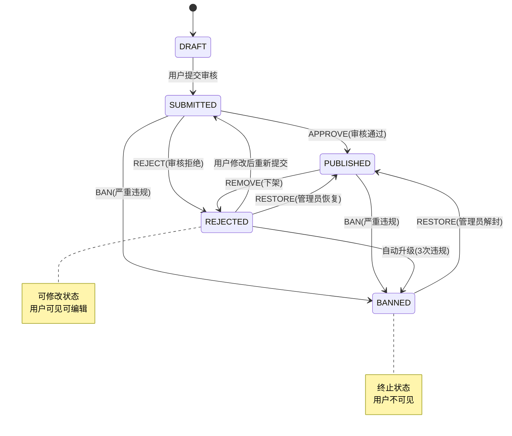

# 内容审核系统重构设计文档

## 一、背景和目标

### 当前问题
1. **缺乏细粒度的封禁控制**：现在只有一个 `BANNED` 状态，用户被ban后完全无法操作
2. **缺少"可修改后重审"流程**：对于内容质量不达标、格式问题等轻度违规，应该允许用户修改后重新提交
3. **统计数据不一致**：内容被封禁后，父对象和用户的统计数据没有相应减少

### 改进目标
1. 区分两种封禁场景：
   - **软封禁**（可修改）：内容质量问题、轻度违规，用户可在个人空间看到并修改后重新提交
   - **硬封禁**（不可修改）：严重违规（色情、暴力、诈骗等），用户不可见不可操作
2. 建立违规升级机制：多次违规自动升级为永久封禁
3. 维护统计数据一致性：封禁时减少对应的计数
4. 完善通知系统：用户收到明确的审核结果和修改建议

---

## 二、状态流转设计

### 内容状态枚举
```java
public enum ContentState {
    DRAFT(0, "草稿"),           // 用户编辑中
    SUBMITTED(1, "待审核"),      // 提交审核
    PUBLISHED(2, "已发布"),      // 审核通过，公开可见
    REJECTED(3, "审核拒绝"),     // 不通过但可修改重提（包括拒绝和下架）
    BANNED(4, "永久封禁")        // 严重违规，用户不可操作
}
```

### 状态流转图



**状态说明：**
- **DRAFT**：草稿，用户编辑中
- **SUBMITTED**：待审核，已提交等待审核
- **PUBLISHED**：已发布，审核通过公开可见
- **REJECTED**：审核拒绝/已下架，用户可见可修改
- **BANNED**：永久封禁，用户不可见不可操作

**操作说明：**
1. **APPROVE**：审核通过，`SUBMITTED` → `PUBLISHED`
2. **REJECT**：审核拒绝，`SUBMITTED` → `REJECTED`
3. **BAN**：封禁操作
   - 待审核内容：`SUBMITTED` → `BANNED`
   - 已发布内容：`PUBLISHED` → `BANNED`
4. **REMOVE**：内容下架（**仅Post/Roadmap/CardDeck支持**）
   - `PUBLISHED` → `REJECTED`
   - 用户可修改后重新提交
5. **自动升级**：`REJECTED` → `BANNED`（当 `reject_count >= 3`）
6. **重新提交**：`REJECTED` → `SUBMITTED`（用户修改后）
7. **RESTORE**：恢复操作（**仅管理员可执行**）
   - `REJECTED` → `PUBLISHED`：撤销拒绝/下架，恢复发布
   - `BANNED` → `PUBLISHED`：解封内容（仅超级管理员）
```

### 审核操作说明

#### 1. APPROVE（审核通过）
- **适用状态**：`SUBMITTED` → `PUBLISHED`
- **场景**：内容符合要求
- **后续操作**：
  - 发送通知：审核通过
  - 内容公开可见

#### 2. REJECT（审核拒绝）
- **适用状态**：`SUBMITTED` → `REJECTED`
- **场景**：内容质量不达标、信息不完整、格式错误（非违规）
- **后续操作**：
  - `reject_count++`
  - 发送通知：审核未通过，附带原因和修改建议
  - 用户可修改后重新提交

#### 3. REMOVE（内容下架）
- **适用状态**：`PUBLISHED` → `REJECTED`
- **场景**：已发布内容发现问题（轻度违规：spam、不当内容、广告）
- **仅适用于**：`Post`、`Roadmap`、`MemoryCardDeck`
- **后续操作**：
  - `reject_count++`
  - 减少对象维度统计（content_stats）
  - 减少用户维度统计（user_stats）
  - 发送通知：内容已下架，附带原因
  - 用户可修改后重新提交
  - **自动升级**：`reject_count >= 3` 自动变为 `BANNED`

#### 4. BAN（永久封禁）
- **适用状态**：`SUBMITTED/PUBLISHED` → `BANNED`
- **场景**：严重违规（色情、暴力、诈骗、政治敏感）
- **后续操作**：
  - 减少对象维度统计（content_stats）
  - 减少用户维度统计（user_stats）
  - 发送通知：内容已被永久封禁
  - 用户不可见、不可操作

#### 5. RESTORE（恢复/解封）
- **适用状态**：`REJECTED/BANNED` → `PUBLISHED`
- **场景**：管理员误操作，需要撤销审核决定
- **权限要求**：
  - `REJECTED` → `PUBLISHED`：MODERATOR 及以上
  - `BANNED` → `PUBLISHED`：仅 ADMIN（超级管理员）
- **后续操作**：

**从 REJECTED 恢复**：
```java
1. 更新状态: state = PUBLISHED
2. reject_count--（撤销之前的拒绝记录）
3. 如果之前是 REMOVE 操作（从 PUBLISHED 下架的）：
   - 恢复对象维度统计（content_stats）
   - 恢复用户维度统计（user_stats）
4. 发送通知: 内容已恢复发布
5. 记录操作日志
```

**从 BANNED 解封**：
```java
1. 更新状态: state = PUBLISHED
2. 恢复对象维度统计（content_stats）
3. 恢复用户维度统计（user_stats）
4. 发送通知: 内容已解封
5. 记录操作日志（高危操作）
```

**注意事项**：
- RESTORE 操作不会清零 `reject_count`，只会 -1
- 需要在 operation_log 中记录原因
- 解封（BANNED → PUBLISHED）应该非常谨慎，建议需要审批流程

---

## 三、数据库设计

### 3.1 新增字段

#### content_stats 表新增字段
```sql
-- 对象维度统计字段
ALTER TABLE content_stats ADD COLUMN posts INT DEFAULT 0 NOT NULL COMMENT '帖子总数（用于Node统计）';
ALTER TABLE content_stats ADD COLUMN articles INT DEFAULT 0 NOT NULL COMMENT '文章数量（用于Node统计）';
ALTER TABLE content_stats ADD COLUMN indexes INT DEFAULT 0 NOT NULL COMMENT '目录数量（用于Node统计）';
ALTER TABLE content_stats ADD COLUMN roadmaps INT DEFAULT 0 NOT NULL COMMENT '路线图数量（用于Profession统计）';
ALTER TABLE content_stats ADD COLUMN card_decks INT DEFAULT 0 NOT NULL COMMENT '记忆卡片组数量（用于Post/Node统计）';

-- 违规统计字段
ALTER TABLE content_stats ADD COLUMN reject_count INT DEFAULT 0 NOT NULL COMMENT '被拒绝/下架次数';
```

**设计说明：**
- `reject_count` 放在 content_stats 表而不是各内容表，原因：
  1. 本质上是统计数据，和 views、comments 等字段一致
  2. 只需修改 1 个表，而不是 7 个内容表
  3. 统一管理所有统计相关字段
  4. 已有的 ContentStatsDataService 提供完善的原子操作

### 3.2 统计数据结构

#### content_stats（对象维度统计）
| 字段 | 类型 | 说明 | 用途 |
|------|------|------|------|
| content_type | INT | 内容类型 | 主键1 |
| content_id | BIGINT | 内容ID | 主键2 |
| views | INT | 浏览量 | 按日统计 |
| twices | INT | 两次能懂数 | 按日统计 |
| likes | INT | 有用点赞数 | 按日统计 |
| **comments** | INT | **评论数** | **所有类型通用** |
| shares | INT | 分享数 | - |
| bookmarks | INT | 收藏数 | - |
| **posts** | INT | **帖子总数** | **Node 专用** |
| **articles** | INT | **文章数** | **Node 专用** |
| **indexes** | INT | **目录数** | **Node 专用** |
| **roadmaps** | INT | **路线图数** | **Profession 专用** |
| **card_decks** | INT | **卡片组数** | **Post/Node 专用** |
| **reject_count** | INT | **被拒绝/下架次数** | **所有类型通用** |

#### user_stats（用户维度统计）
| 字段 | 类型 | 说明 |
|------|------|------|
| user_id | BIGINT | 用户ID（主键）|
| views | INT | 总浏览量 |
| twices | INT | 总两次能懂数 |
| likes | INT | 总有用点赞数 |
| **comments** | INT | **总评论数** |
| **created_articles** | INT | **创建的文章数** |
| **created_indexs** | INT | **创建的目录数** |
| **created_roadmaps** | INT | **创建的路线图数** |
| **created_card_decks** | INT | **创建的卡片组数** |

---

## 四、统计数据更新逻辑

### 4.1 内容创建时的统计初始化

当内容被创建或审核通过（APPROVE）时，需要增加对应的统计计数：

#### Post 创建/审核通过
```java
Post.APPROVE (SUBMITTED → PUBLISHED):
  // 增加 Node 的帖子统计
  if (post.type == ARTICLE) {
      contentStatsDataService.atomicIncrement(NODE, post.nodeId, "articles", 1);
  }
  if (post.type == INDEX) {
      contentStatsDataService.atomicIncrement(NODE, post.nodeId, "indexes", 1);
  }
  // 总帖子数
  contentStatsDataService.atomicIncrement(NODE, post.nodeId, "posts", 1);

  // 增加用户创作统计
  if (post.type == ARTICLE) {
      userStatsDataService.atomicIncrement(post.creatorId, "created_articles", 1);
  }
  if (post.type == INDEX) {
      userStatsDataService.atomicIncrement(post.creatorId, "created_indexs", 1);
  }
```

#### Roadmap 审核通过
```java
Roadmap.APPROVE (SUBMITTED → PUBLISHED):
  // 增加 Profession 的路线图统计
  contentStatsDataService.atomicIncrement(PROFESSION, roadmap.professionId, "roadmaps", 1);

  // 增加用户创作统计
  userStatsDataService.atomicIncrement(roadmap.creatorId, "created_roadmaps", 1);
```

#### MemoryCardDeck 审核通过
```java
MemoryCardDeck.APPROVE (SUBMITTED → PUBLISHED):
  // 增加 Post 或 Node 的卡片组统计
  if (deck.postId != null) {
      contentStatsDataService.atomicIncrement(POST, deck.postId, "card_decks", 1);
  } else if (deck.nodeId != null) {
      contentStatsDataService.atomicIncrement(NODE, deck.nodeId, "card_decks", 1);
  }

  // 增加用户创作统计
  userStatsDataService.atomicIncrement(deck.creatorId, "created_card_decks", 1);
```

#### Comment 审核通过
```java
Comment.APPROVE (SUBMITTED → PUBLISHED):
  // 增加被评论对象的评论数
  contentStatsDataService.atomicIncrement(comment.objectType, comment.objectId, "comments", 1);

  // 增加用户评论统计
  userStatsDataService.atomicIncrement(comment.creatorId, "comments", 1);
```

---

### 4.2 内容删除时的统计减少（BAN/REMOVE）

#### 对象维度（content_stats）

##### Post 被 BAN/REMOVE
```java
// 减少 Node 的帖子统计
if (post.type == ARTICLE) {
    contentStatsDataService.atomicIncrement(NODE, post.nodeId, "articles", -1);
}
if (post.type == INDEX) {
    contentStatsDataService.atomicIncrement(NODE, post.nodeId, "indexes", -1);
}
// 总帖子数
contentStatsDataService.atomicIncrement(NODE, post.nodeId, "posts", -1);
```

#### Comment 被 BAN/REMOVE
```java
// 减少被评论对象的评论数
contentStatsDataService.atomicIncrement(
    comment.objectType,  // POST/COMMENT/NODE/ROADMAP
    comment.objectId,
    "comments",
    -1
);
```

#### Roadmap 被 BAN
```java
// 减少 Profession 的路线图数
contentStatsDataService.atomicIncrement(PROFESSION, roadmap.professionId, "roadmaps", -1);
```

#### MemoryCardDeck 被 BAN/REMOVE
```java
// 减少 Post 或 Node 的卡片组数
if (deck.postId != null) {
    contentStatsDataService.atomicIncrement(POST, deck.postId, "card_decks", -1);
} else if (deck.nodeId != null) {
    contentStatsDataService.atomicIncrement(NODE, deck.nodeId, "card_decks", -1);
}
```

### 4.2 用户维度（user_stats）

#### Post 被 BAN/REMOVE
```java
if (post.type == ARTICLE) {
    userStatsDataService.atomicIncrement(post.creatorId, "created_articles", -1);
}
if (post.type == INDEX) {
    userStatsDataService.atomicIncrement(post.creatorId, "created_indexs", -1);
}
```

#### Comment 被 BAN/REMOVE
```java
userStatsDataService.atomicIncrement(comment.creatorId, "comments", -1);
```

#### Roadmap 被 BAN
```java
userStatsDataService.atomicIncrement(roadmap.creatorId, "created_roadmaps", -1);
```

#### MemoryCardDeck 被 BAN/REMOVE
```java
userStatsDataService.atomicIncrement(deck.creatorId, "created_card_decks", -1);
```

---

## 五、通知系统设计

### 通知类型

虽然 REJECT 和 REMOVE 都会将内容状态设置为 `REJECTED`，但发送的通知消息需要区分：

#### 1. 审核通过通知（APPROVE）
```
标题：审核通过
内容：您的 [内容类型] "{标题}" 已审核通过并发布。
```

#### 2. 审核拒绝通知（REJECT）
```
标题：审核未通过
内容：您的 [内容类型] "{标题}" 审核未通过。
原因：{审核员填写的原因}
建议：请根据反馈修改后重新提交。
链接：[修改内容]
```

#### 3. 内容下架通知（REMOVE）
```
标题：内容已下架
内容：您的 [内容类型] "{标题}" 因违反社区规范已被下架。
原因：{审核员填写的原因}
建议：请修改内容后重新提交审核。
警告：多次违规（≥3次）将导致内容被永久封禁。
当前违规次数：{reject_count}/3
链接：[修改内容]
```

#### 4. 永久封禁通知（BAN）
```
标题：内容已被封禁
内容：您的 [内容类型] "{标题}" 因严重违规已被永久封禁。
原因：{审核员填写的原因}
说明：该内容已被永久删除，无法恢复。
```

**通知区别说明：**
- **REJECT**：强调"审核未通过"，语气中性，引导用户修改质量问题
- **REMOVE**：强调"违反规范"，语气严肃，显示违规次数警告
- 两者最终状态相同（`REJECTED`），但用户感知不同

### 通知内容参数

不同内容类型需要提供的参数：

#### Post（帖子）
- postId
- postTitle/postPreview（前100字符）
- nodeId、nodeName
- courseName
- **需要发送通知**：✅ APPROVE / REJECT / REMOVE / BAN

#### Comment（评论）
- commentId
- commentPreview（前100字符）
- objectType、objectId、objectTitle
- **不需要发送通知**：❌ 所有操作都不发送（APPROVE / REJECT / BAN）

#### Roadmap（路线图）
- roadmapId
- professionId、professionName
- **需要发送通知**：✅ APPROVE / REJECT / BAN

#### MemoryCardDeck（记忆卡片组）
- deckId、deckTitle
- postId、postTitle
- **需要发送通知**：✅ APPROVE / REJECT / REMOVE / BAN

#### Course（课程）
- courseId、courseName
- **需要发送通知**：✅ APPROVE / REJECT / BAN

#### Profession（职业）
- professionId、professionName
- **需要发送通知**：✅ APPROVE / REJECT / BAN

#### Node（节点）
- nodeId、nodeName
- courseId、courseName
- **需要发送通知**：✅ APPROVE / REJECT / BAN

**说明**：
- Comment 不需要发送审核通知，因为：
  1. 评论数量多，通知会过于频繁
  2. 评论是即时性内容，用户通常不会关注审核状态
  3. 被拒绝的评论用户在个人空间可见即可

---

## 六、API 设计

### 审核操作 API

#### 统一操作接口
```
POST /api/v1/admin/{contentType}/{id}/approve

Request Body:
{
  "action": "approve" | "reject" | "remove" | "ban" | "restore",
  "reason": "审核员填写的原因（reject/remove/ban/restore时必填）"
}
```

**说明**：
- `restore` 操作需要特殊权限验证
- `restore` 从 BANNED 解封时，需要 ADMIN 权限

#### 各内容类型支持的操作

| 内容类型 | 对 SUBMITTED | 对 PUBLISHED | 备注 |
|---------|-------------|-------------|------|
| **Post** | approve / reject / ban | remove / ban | 支持 REMOVE |
| **Roadmap** | approve / reject / ban | remove / ban | 支持 REMOVE |
| **CardDeck** | approve / reject / ban | remove / ban | 支持 REMOVE |
| **Course** | approve / reject / ban | - | 不支持 REMOVE |
| **Profession** | approve / reject / ban | - | 不支持 REMOVE |
| **Node** | approve / reject / ban | - | 不支持 REMOVE |
| **Comment** | approve / reject / ban | - | 不支持 REMOVE |

---

## 七、实施计划

### 第一阶段：数据库和基础设施（2-3小时）
1. ✅ 创建数据库迁移脚本
2. ✅ 修改所有内容 DO 类，添加 `rejectCount` 字段
3. ✅ 修改 `ContentStatsDO`，添加新的统计字段
4. ✅ 修改 `ContentStatsMapper.xml`，更新字段映射
5. ✅ 测试数据库迁移

### 第二阶段：Domain Service 层（3-4小时）
6. ⬜ 为 PostDomainService 添加 `remove()` 方法
7. ⬜ 为 RoadmapDomainService 添加 `remove()` 方法
8. ⬜ 为 MemoryCardDeckDomainService 添加 `remove()` 方法
9. ⬜ 修改所有 DomainService 的 `reject()` 方法，增加 `reject_count++` 逻辑
10. ⬜ 修改所有 DomainService 的 `ban()` 方法，增加统计减少逻辑
11. ⬜ 实现 `reject_count >= 3` 自动升级为 `BANNED` 的逻辑

### 第三阶段：Application Service 层（2-3小时）
12. ⬜ 修改 PostService，实现 `remove()` 和统计更新
13. ⬜ 修改 RoadmapService，实现 `remove()` 和统计更新
14. ⬜ 修改 MemoryCardDeckService，实现 `remove()` 和统计更新
15. ⬜ 修改 CommentService，实现统计更新
16. ⬜ 修改 CourseService，实现通知发送
17. ⬜ 修改 ProfessionService，实现通知发送
18. ⬜ 修改 NodeService，实现通知发送

### 第四阶段：Controller 层（1-2小时）
19. ⬜ 修改 AdminPostsController，支持 `remove` action
20. ⬜ 修改 AdminRoadmapsController，支持 `remove` action
21. ⬜ 修改 AdminMemoryController，支持 `remove` action
22. ⬜ 确认其他 AdminController 不支持 `remove` action

### 第五阶段：前端（3-4小时）
23. ⬜ 更新审核界面，根据内容类型显示不同操作按钮
24. ⬜ 更新通知显示组件，展示新的通知格式
25. ⬜ 更新用户个人空间，显示 REJECTED 状态的内容
26. ⬜ 添加"修改并重新提交"功能

### 第六阶段：测试和验证（2-3小时）
27. ⬜ 单元测试：各 Service 的审核方法
28. ⬜ 集成测试：完整的审核流程
29. ⬜ 统计数据一致性测试
30. ⬜ 通知发送测试
31. ⬜ 前端功能测试

---

## 八、待讨论的问题

### 1. content_stats 字段命名
- `posts` 是否需要？因为 `posts = articles + indexes`，可以动态计算
- 建议：保留，避免重复查询

### 2. REMOVE 操作的限制
- 是否只能对 `state=PUBLISHED` 的内容执行？
- 建议：是的，对 `SUBMITTED` 应该用 `REJECT`

### 3. 自动升级阈值
- `reject_count >= 3` 是否合适？
- 是否需要区分不同内容类型？
- 建议：统一为 3 次，可以后续通过配置调整

### 4. Course/Profession/Node 不支持 REMOVE 的原因
- 这些内容在审核通过前不会公开显示
- 审核通过后一般不会下架（除非严重违规直接 BAN）
- 建议：保持这个设计

### 5. 统计数据的初始化
- 对于历史数据，如何初始化新增的统计字段？
- 建议：写一个数据迁移脚本，统计现有数据并更新

### 6. Comment 的对象类型
- Comment 可以评论 POST/COMMENT/NODE/ROADMAP
- 是否还有其他对象类型需要支持？
- 建议：目前这四种足够

### 7. MemoryCardDeck 的父对象
- CardDeck 可以关联 Post 或 Node
- 如果同时有 postId 和 nodeId，优先哪个？
- 建议：优先 postId（需要检查业务逻辑确认）

---

## 九、风险和注意事项

### 技术风险
1. **统计数据一致性**：需要确保所有增减操作都是原子性的
2. **历史数据迁移**：需要脚本初始化新字段的统计数据
3. **并发问题**：多个审核员同时操作同一内容时的状态一致性

### 业务风险
1. **误操作风险**：审核员误点 BAN 而非 REMOVE
2. **用户体验**：REJECTED 状态的内容如何在前端展示
3. **违规定义**：需要明确的社区规范和审核标准

### 迁移策略
1. **分阶段上线**：先上线后端逻辑，前端保持兼容
2. **灰度发布**：先对部分内容类型启用新逻辑
3. **数据备份**：迁移前备份所有统计数据
4. **回滚方案**：准备回滚脚本，恢复旧状态

---

## 十、附录

### A. 相关文件清单

#### 后端
- **DO 实体类**：PostDO, CommentDO, RoadmapDO, MemoryCardDeckDO, CourseDO, ProfessionDO, NodeDO, ContentStatsDO
- **Mapper**：对应的 Mapper 接口和 XML
- **Domain Service**：PostDomainService, CommentDomainService, RoadmapDomainService 等
- **Application Service**：PostService, CommentService, RoadmapService, MessageService 等
- **Controller**：AdminPostsController, AdminCommentsController, AdminRoadmapsController 等

#### 前端
- **类型定义**：post.d.ts, comment.d.ts, roadmap.d.ts 等
- **API 模块**：admin.ts
- **审核界面组件**：待确认
- **用户空间组件**：待确认

### B. 参考文档
- `docs/DATABASE_INDEX_RECOMMENDATIONS.md`
- `backend/CLAUDE.md`
- `web/CODE_STANDARDS.md`

---

**文档版本**：v1.0
**创建日期**：2025-12-12
**作者**：Claude Code
**状态**：待讨论
